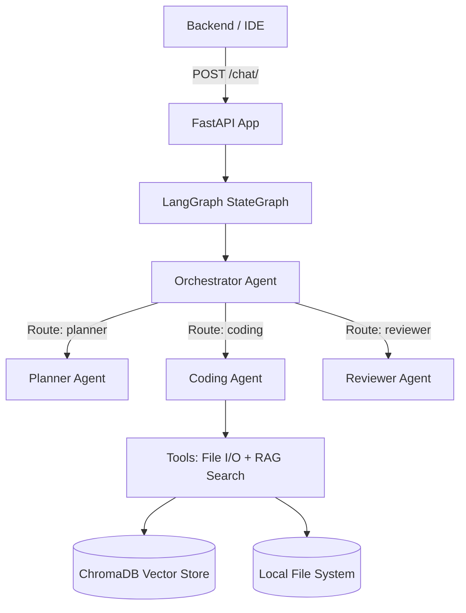
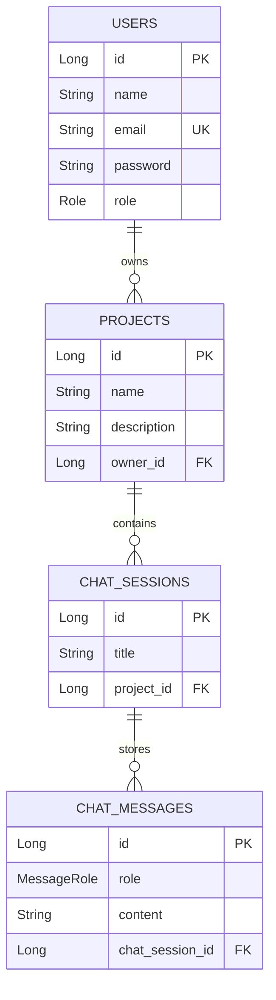

# Cortexa / BackendForge — AI Workspace IDE Evaluation Report

**Project Root:** `/home/anudeep/Desktop/capstone-project`  
**Vision Target:** Cursor / Antigravity Style AI Workspace IDE (Left File Tree | Middle Editor/IDE | Right AI Assistant Panel)  
**Date:** July 28, 2026

---

## Executive Summary

The **Cortexa / BackendForge** capstone platform is designed as an AI-powered developer environment. To achieve your goal of building an **AI Workspace IDE** (similar to Cursor or Google Antigravity), the architecture must support three core pillars:
1. **Left Panel — File Tree & Workspace Management:** Virtual filesystem access, file CRUD operations, and workspace directory tree navigation.
2. **Middle Panel — Code Editor / IDE:** Multi-tab file viewer, syntax highlighting, live diff previews, and direct inline code modifications.
3. **Right / Floating Panel — Multi-Agent AI Sidecar:** Real-time token streaming, active agent indicators (Planner, Coding, Reviewer), tool call feedback, and codebase RAG grounded in project source code.

Below is a detailed separate review and roadmap for both the **`ai-service`** and **`backend`** modules.

---

## Part 1: AI Service Evaluation (`/ai-service`)

### Overview & Architecture
`ai-service` is built with **FastAPI**, **LangGraph**, **LangChain**, **Groq (LLM Provider)**, and **ChromaDB**. It implements an orchestrator-workers state graph where an Orchestrator routes tasks to a Planner, Coding, or Reviewer agent.



### 1. Current Features
* **Multi-Agent LangGraph Workflow:** Dynamic request routing using `OrchestratorAgent` into `PlannerAgent`, `CodingAgent`, or `ReviewerAgent`.
* **Stateful Thread Memory:** Integrates `MemorySaver` checkpointer for thread history using `thread_id`.
* **RAG Pipeline:** PDF document indexing via `pypdf`, `RecursiveCharacterTextSplitter`, Ollama Embeddings, and ChromaDB vector store.
* **Provider Abstraction (`providers/`):** Clean separation of LLM providers using OpenAI-compatible `ChatOpenAI` against Groq endpoints.
* **Tool Integration (`tools/`):** Document search tool (`search_documents`) and filesystem manipulation tools (`read_file`, `write_file`, `list_directory`, `file_exists`, `read_multiple_files`).
* **Global Exception Handling & Logging:** Basic error handler returning structured JSON 500 responses.

### 2. Features Required for Cursor / Antigravity AI Workspace IDE
* ⚡ **Server-Sent Events (SSE) / WebSocket Streaming:** Replace static JSON responses with streaming tokens (`graph.stream(...)`) so the IDE chat panel shows real-time LLM typing and live agent status badges (e.g. `[Planner] Thinking...`, `[Coding] Invoking search_documents...`).
* 📝 **Diff Generation Engine:** Implement an Edit Code tool that outputs GitHub-style diff blocks (`- old line`, `+ new line`) so the middle IDE editor can render interactive inline diff previews and single-click apply buttons.
* 📂 **Source Code RAG Indexing:** Extend the RAG ingestion pipeline beyond PDFs to index `.java`, `.py`, `.ts`, `.json`, `.md` source files from the user's active project repository.
* 🛠️ **Project Workspace Scoping:** Accept `workspace_path` or `project_id` in requests to scope vector stores and filesystem tools strictly within the user's selected project folder.
* ⚡ **Command Execution Sandbox:** Add a terminal agent/tool to safely execute build/test commands (`mvn test`, `pytest`, `npm test`) inside an isolated workspace context.

### 3. Issues & Resolutions

| # | Current Issue | Impact | Resolution |
|---|---|---|---|
| 1 | **No Response Streaming** (`api/chat.py` calls synchronous `graph.invoke`) | User waits 10–20 seconds with blank UI before seeing full response. | Refactor `/chat` endpoint to return `StreamingResponse` using `graph.stream(...)` with SSE event frames. |
| 2 | **PDF-Only Document Ingestion** (`api/document.py` rejects non-PDFs) | Developer source code cannot be indexed for RAG context. | Replace extension check with support for plain text and source code formats (`.java`, `.py`, `.js`, `.ts`, `.md`, `.json`). |
| 3 | **Global Vector Store** (ChromaDB uses fixed default collection) | Documents from different projects get mixed together. | Namespace ChromaDB collections by `project_id` during ingestion and search. |

### 4. Module Rating & Justification

# 🌟 Rating: 7.5 / 10

> **Justification:** `ai-service` boasts a clean architecture, elegant provider abstraction, and well-designed LangGraph orchestration. To evolve into a Cursor/Antigravity-level engine, it needs streaming response support, source code indexing, and diff-generation tools.

---

## Part 2: Backend Service Evaluation (`/backend`)

### Overview & Architecture
`backend` is a Java 21 & **Spring Boot 3.5.4** microservice responsible for tenant authentication, MySQL data persistence, user projects, chat history, and proxying AI requests to `ai-service`.



### 1. Current Features
* **Stateless JWT Security:** `JwtAuthenticationFilter`, `JwtService`, and `BCryptPasswordEncoder` securing APIs under `/api/**`.
* **Multi-Tenant Domain Security:** Custom Spring Data JPA repository methods enforcing owner verification on projects and chat sessions (`findByIdAndOwner`, `findByIdAndProjectOwner`).
* **CRUD APIs:** Full REST endpoints for user auth, project management, and chat session creation with chronologically ordered message history.
* **AI Service Gateway (`AiGatewayService`):** HTTP client adapter using Spring `WebClient` to communicate with `ai-service`.

### 2. Features Required for Cursor / Antigravity AI Workspace IDE
* 📁 **Virtual Workspace Filesystem API:** Endpoints to support the Left File Tree panel in the IDE:
  * `GET /api/projects/{id}/files/tree`: Returns hierarchical JSON file tree structure.
  * `GET /api/projects/{id}/files/content?path=...`: Retrieves file content for middle IDE tabs.
  * `PUT /api/projects/{id}/files/content`: Saves code edits made in the middle editor.
* 🌊 **Reactive WebFlux SSE Proxy:** Proxy SSE streams from `ai-service` through Spring Boot (`Flux<ServerSentEvent>`) to stream response tokens live to the frontend IDE client.
* 📜 **Flyway Database Migrations:** Versioned SQL migration scripts (`src/main/resources/db/migration/V1__init_schema.sql`) for safe schema management.
* 🌐 **CORS Configuration:** Configure Spring Security CORS bean to permit frontend IDE connections (e.g. Vite on `http://localhost:5173`).
* 💻 **Interactive Terminal WebSocket:** WebSocket handler to stream terminal I/O for integrated command execution inside the IDE UI.

### 3. Issues & Resolutions

| # | Current Issue | Impact | Resolution |
|---|---|---|---|
| 1 | **Database Auto-Wipe** (`spring.jpa.hibernate.ddl-auto=create` in `application.properties`) | Drops all MySQL tables and wipes data every time Spring Boot restarts. | Change `ddl-auto` to `update` immediately or enable Flyway migrations. |
| 2 | **Blocking WebClient Calls** (`AiGatewayService` uses `.block()`) | Blocks Tomcat worker threads during LLM generation, causing thread exhaustion under load. | Convert `AiGatewayService` to return reactive `Mono<AiResponse>` or `Flux<String>` for streaming. |
| 3 | **Missing CORS Setup in SecurityConfig** | Web browsers will block API calls from a separate frontend port/origin. | Register a `CorsConfigurationSource` bean allowing headers `Authorization`, `Content-Type`, and standard frontend origins. |
| 4 | **Missing Global Exception Handler** (`@ControllerAdvice`) | Unhandled exceptions return raw HTTP 500 error stack traces. | Add `GlobalExceptionHandler` with `@ExceptionHandler` methods to format clean JSON error DTOs. |

### 4. Module Rating & Justification

# 🌟 Rating: 7.0 / 10

> **Justification:** Solid, clean Spring Boot architecture with strong multi-tenant security and JPA repository design. To power an AI IDE like Cursor/Antigravity, it must be upgraded with workspace file management endpoints, SSE streaming proxies, CORS enablement, and database migration tooling.

---

## Overall Capstone Platform Evaluation

```
      Cortexa AI Workspace Platform Overall Rating: 7.25 / 10
      ======================================================
      [ai-service] : 7.5 / 10  (LangGraph, RAG, Multi-Agent Routing)
      [backend]    : 7.0 / 10  (Spring Boot, JWT Auth, Multi-tenant DB)
```

---

## Suggested Implementation Roadmap for AI Workspace IDE

### Phase 1: Core Fixes & Security (Immediate)
1. Fix `ddl-auto=update` and add CORS configuration to `backend`.
2. Add `@ControllerAdvice` global exception handling to both services.

### Phase 2: Workspace Filesystem APIs (Left Panel + Middle IDE)
1. Implement File Tree & File Content endpoints in `backend` (`ProjectFileController`).
2. Integrate workspace directory path scoping in `ai-service` tool calls.

### Phase 3: Real-Time Streaming & IDE Diff Capabilities (AI Sidecar)
1. Add SSE streaming to FastAPI `ai-service` (`/chat/stream`) and proxy through Spring Boot `WebFlux`.
2. Add Diff/Patch tool to `CodingAgent` to return formatted inline code edits for the IDE editor.
